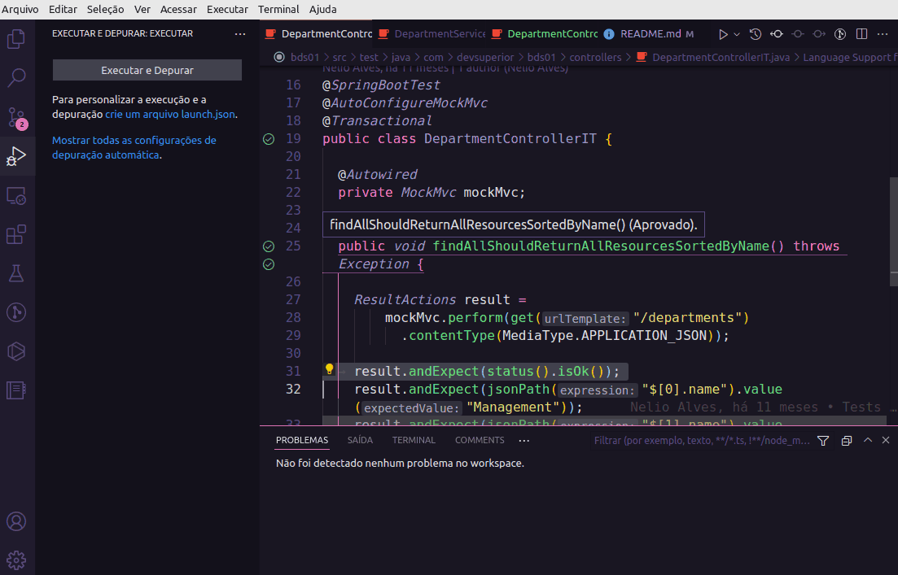
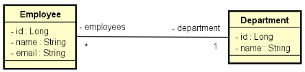

 <div align="center" id="top"> 


</div>

<h1 align="center">Bds01 TDD - Test Driven Development</h1>

<p align="center">
  

  

  

  

  <!--  -->

  

  <!--  -->
</p>

<!-- Status -->

<!-- <h4 align="center">
	🚧  Bds01 🚀 Under construction...  🚧
</h4>

<hr> -->

<p align="center">
  <a href="#dart-about">About</a> &#xa0; | &#xa0; 
  <a href="#sparkles-features">Features</a> &#xa0; | &#xa0;
  <a href="#rocket-technologies">Technologies</a> &#xa0; | &#xa0;
  <a href="#white_check_mark-requirements">Requirements</a> &#xa0; | &#xa0;
  <a href="#checkered_flag-starting">Starting</a> &#xa0; | &#xa0;
  <a href="#memo-license">License</a> &#xa0; | &#xa0;
  <a href="https://github.com/acenelio" target="_blank">Author</a>
</p>

<br>

## :dart: About

Implementation of the necessary functionality for the project tests to pass the java class integration tests.



## :sparkles: Features

:heavy_check_mark: Department controller class integration tests with:\
 :heavy_check_mark: Department REST controller;\
 :heavy_check_mark: Department Service;\
 :heavy_check_mark: Department Data access (Repository);\

:heavy_check_mark: Employee controller class integration tests with:\
 :heavy_check_mark: Employee REST controller;\
 :heavy_check_mark: Employee Service;\
 :construction: Employee Data access (Repository);

## :rocket: Technologies

The following tools were used in this project:

:heavy_check_mark: [Java 11](https://docs.oracle.com/en/java/javase/11/);\
:heavy_check_mark: [Apache Maven](https://maven.apache.org/guides/index.html);\
:heavy_check_mark: [Spring Boot](https://glysns.gitbook.io/springframework/);\
:heavy_check_mark: [Spring Data JPA](https://docs.spring.io/spring-boot/docs/2.5.6/reference/htmlsingle/#boot-features-jpa-and-spring-data);\
:heavy_check_mark: [MockMvc - Testing Spring Web Layer](https://spring.io/guides/gs/testing-web/);

## :white_check_mark: Requirements

Before starting :checkered_flag:, you need to have [Java JDK11](https://www.oracle.com/java/technologies/downloads/#java11), [Git](https://git-scm.com) and [Maven](https://maven.apache.org/download.cgi) installed.

## :checkered_flag: Starting

```bash
# Clone this project
$ git clone https://github.com/jocile/bds01

# Access
$ cd bds01

Import encoding into an IDE like vscode or eclipse with test support.
```

## :memo: License

This project is under license from MIT. For more details, see the [LICENSE](LICENSE.md) file.

Made with :heart: by <a href="https://github.com/jocile" target="_blank">Jocile</a>

&#xa0;

<a href="#top">Back to top</a>
